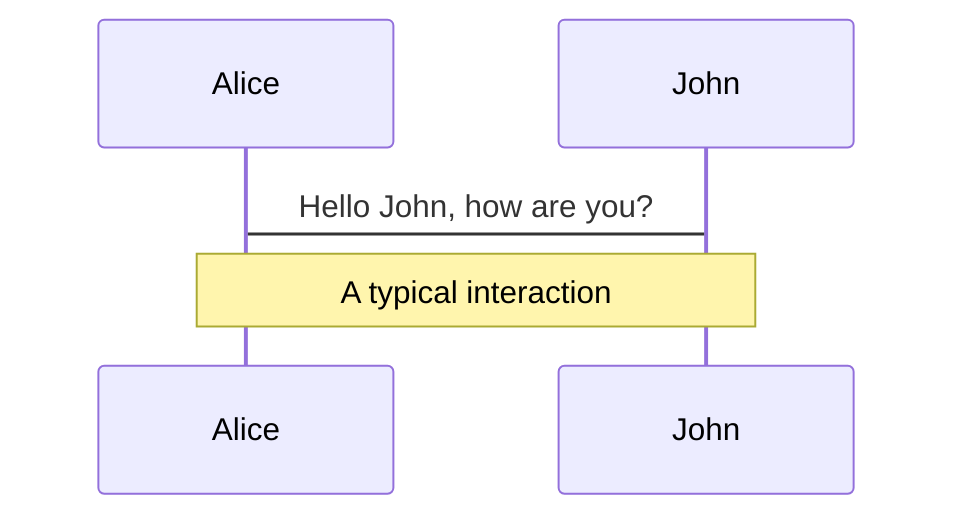
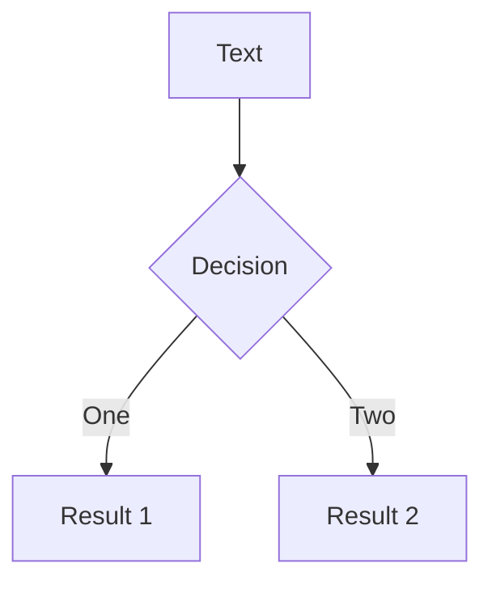

---
# try also 'default' to start simple
theme: seriph
# random image from a curated Unsplash collection by Anthony
# like them? see https://unsplash.com/collections/94734566/slidev
# background: https://source.unsplash.com/collection/94734566/1920x1080
background: './img/conver.jpeg'
# apply any windi css classes to the current slide
class: 'text-center'
# https://sli.dev/custom/highlighters.html
highlighter: shiki
# some information about the slides, markdown enabled
download: true
layout: cover

info: |
  ## About
  ### 徐健
  ### 蜂泰科技--研发管理中心

---

# 大前端技术栈系列

-- -- 前端工程化之路

<div class="pt-12">
  <span class="px-2 p-1">
  蜂泰科技  |  徐 健
  </span>
</div>

<!--
The last comment block of each slide will be treated as slide notes. It will be visible and editable in Presenter Mode along with the slide. [Read more in the docs](https://sli.dev/guide/syntax.html#notes)
-->

---
layout: 'intro'
---

# 徐 健

<div class="leading-8 opacity-80">
<div class="flex "><svg width="24" height="24" viewBox="0 0 48 48" fill="none" xmlns="http://www.w3.org/2000/svg"><rect width="48" height="48" fill="white" fill-opacity="0.01"/><path d="M48 0H0V48H48V0Z" fill="white" fill-opacity="0.01"/><path d="M41 18H19C18.4477 18 18 18.4477 18 19V41C18 41.5523 18.4477 42 19 42H41C41.5523 42 42 41.5523 42 41V19C42 18.4477 41.5523 18 41 18Z" fill="none" stroke="#333" stroke-width="4" stroke-linejoin="round"/><path d="M9.96906 6H6V10.0336" stroke="#333" stroke-width="4" stroke-linecap="round" stroke-linejoin="round"/><path d="M9.99705 30H6V26.012" stroke="#333" stroke-width="4" stroke-linecap="round" stroke-linejoin="round"/><path d="M26.0023 6H30V10.0152" stroke="#333" stroke-width="4" stroke-linecap="round" stroke-linejoin="round"/><path d="M16.0283 6H20.0083" stroke="#333" stroke-width="4" stroke-linecap="round" stroke-linejoin="round"/><path d="M6 16C6 18.6536 6 19.9869 6 20" stroke="#333" stroke-width="4" stroke-linecap="round" stroke-linejoin="round"/><path d="M30 16C30 18.6765 30 19.3456 30 18.0074" stroke="#333" stroke-width="4" stroke-linecap="round" stroke-linejoin="round"/><path d="M15.9927 30H18.0001" stroke="#333" stroke-width="4" stroke-linecap="round"/></svg><span class="mx-4">大前端工程师</span></div>
<div class='flex'><svg width="24" height="24" viewBox="0 0 48 48" fill="none" xmlns="http://www.w3.org/2000/svg"><rect width="48" height="48" fill="white" fill-opacity="0.01"/><path fill-rule="evenodd" clip-rule="evenodd" d="M11 14L25 4V44H11V14Z" fill="none" stroke="#333" stroke-width="4" stroke-linecap="round" stroke-linejoin="round"/><path d="M25 13L39 23V44" stroke="#333" stroke-width="4" stroke-linecap="round" stroke-linejoin="round"/><path d="M4 44H44" stroke="#333" stroke-width="4" stroke-linecap="round" stroke-linejoin="round"/></svg><span class="mx-4">研发管理中心架构组成员</span></div>
<div class='flex'><svg width="24" height="24" viewBox="0 0 48 48" fill="none" xmlns="http://www.w3.org/2000/svg"><rect width="48" height="48" fill="white" fill-opacity="0.01"/><path d="M23.1033 20.817C23.4701 20.0737 24.5299 20.0737 24.8967 20.817L27.8818 26.8654C28.0275 27.1606 28.3091 27.3652 28.6348 27.4125L35.3096 28.3824C36.1298 28.5016 36.4574 29.5096 35.8638 30.0881L31.0339 34.7962C30.7982 35.0259 30.6906 35.3569 30.7463 35.6813L31.8865 42.3292C32.0266 43.1461 31.1691 43.769 30.4355 43.3834L24.4653 40.2446C24.174 40.0915 23.826 40.0915 23.5347 40.2446L17.5645 43.3834C16.8309 43.769 15.9734 43.1461 16.1135 42.3292L17.2537 35.6813C17.3094 35.3569 17.2018 35.0259 16.9661 34.7962L12.1362 30.0881C11.5426 29.5096 11.8702 28.5016 12.6904 28.3824L19.3652 27.4125C19.6909 27.3652 19.9725 27.1606 20.1182 26.8654L23.1033 20.817Z" fill="none" stroke="#333" stroke-width="4" stroke-linecap="round" stroke-linejoin="round"/><path d="M36 4H12V14L24 19L36 14V4Z" fill="none" stroke="#333" stroke-width="4" stroke-linecap="round" stroke-linejoin="round"/></svg><span class="mx-4">超过8年客户端/前端研发经验</span></div>
</div>


---

# 前端到底是什么?

前端开发是创建WEB页面或APP等前端界面呈现给用户的过程，通过HTML，CSS及JavaScript以及衍生出来的各种技术、框架、解决方案，来实现互联网产品的用户界面交互。 --百度百科

<br>

前端技术演进历史：/*待补充图表*/
- **上古时代（1990-2004）** - 静态页面—>javascript-->动态页面
- **web2.0时代（2004-2008）** - 动态交互、数据交互的需求增多 | Ajax开始流行、异步Http请求（典型代表jQuery）
- **发展大爆炸时代（2008-2015）** - 谷歌 V8 引擎发布 | 2009年 Node.js爆发 ｜ MCV、MVVM、SPA应用框架(典型代表AngularJS、ReactJS、VueJS)
- **今天的前端（2015-2020）** - 跨端（小程序、跨容器、跨平台、跨OS）｜ 标准成熟（ECMA、包管理、构建、框架、nodejs、Hybrid ...）
- **未来的前端（2020~）** - 可视化 ｜ 智能化｜ 工具链 | serverless | lowcode/nocode ｜ WebAssembly
<br>
<br>


<style>
h1 {
  background-color: #2B90B6;
  background-image: linear-gradient(45deg, #4EC5D4 10%, #146b8c 20%);
  background-size: 100%;
  -webkit-background-clip: text;
  -moz-background-clip: text;
  -webkit-text-fill-color: transparent; 
  -moz-text-fill-color: transparent;
}
</style>
<!--
You can have `style` tag in markdown to override the style for the current page.
Learn more: https://sli.dev/guide/syntax#embedded-styles
-->
---

# 工程化的意义?

The only constant in the world is change.
世界上唯一不变的是变化。–《谁动了我的奶酪》作者 斯宾塞·约翰逊

工程化之前遇到的问题：/*待补充图表*/
<br>
最早的前端开发就是实现页面，顶多再写写JS让页面可以有交互的特效。但是随着需求的增加，我们不仅要做Web应用，还要做App、小程序以及各种端。在这种需求日增的情况下，必须得考虑一种新的方式，优化前端的开发工作，例如，解决代码冗余，项目可维护性，提升版本迭代速度等等一系列的问题。前端工程化的概念也就是在这中情况下被提出了。
<br>
<br>

<style>
h1 {
  background-color: #2B90B6;
  background-image: linear-gradient(45deg, #4EC5D4 10%, #146b8c 20%);
  background-size: 100%;
  -webkit-background-clip: text;
  -moz-background-clip: text;
  -webkit-text-fill-color: transparent; 
  -moz-text-fill-color: transparent;
}
</style>

<!--
IT 行业变化太快了，尤其是前端开发（Frontend Development）。如果能穿越回 10 年前，碰上一位 Web 开发软件工程师，他一定会告诉你玩转前端就是精通 jQuery 和搞定 IE 浏览器兼容性。不过随着前端的不断发展，jQuery 遭遇 “官方逼死同人” 逐渐退出历史舞台（元素选择和操作被标准的 DOM API 所统一）；而饱为诟病的 IE 浏览器兼容性问题，因为 IE 市场的逐渐萎缩以及一些兼容性工具（Polyfill）的出现，让其从之前的核心优化问题降级为如今的瘙痒问题，不再成为前端工程师的标配。
虽然前端工程化的概念兴起还没几年的时间，但是对于“工程化”这个词并不是一个新鲜词了，在其他软件开发的领域很早就已经有了高度的工程化，例如Web服务端开发。只不过那个时候，前端工程师并没有工程化的意识，也没有必要对前端进行工程化的操作，毕竟在那个时期，前端的开发工作只能算是整个项目开发过程中的“附属品”。
-->

---

# 什么是前端工程化?
解放生产力、提高生产效率。通过制定相应的规范，借助一系列工具和手段解决整个工作流程中的痛点。

特点：/*待补充图表*/
- 模块化
- 组件化
- 规范化
- 自动化

以工程的角度去理解前端。工程是工程，而不是某项技术。

<style>
h1 {
  background-color: #2B90B6;
  background-image: linear-gradient(45deg, #4EC5D4 10%, #146b8c 20%);
  background-size: 100%;
  -webkit-background-clip: text;
  -moz-background-clip: text;
  -webkit-text-fill-color: transparent; 
  -moz-text-fill-color: transparent;
}
</style>

<!--
模块化

组件化

规范化

自动化

-->

---


# 前端工程化--模块化
模块化是指将一个文件拆分成多个相互依赖的文件，最后进行统一的打包和加载，这样能够很好的保证高效的多人协作。

- JS 模块化：CommonJS、AMD、CMD 以及 ES6 Module。
- CSS 模块化：Sass、Less、Stylus、BEM、CSS Modules 等。其中预处理器和 BEM 都会有的一个问题就是样式覆盖。而 CSS Modules 则是通过 JS 来管理依赖，最大化的结合了 JS 模块化和 CSS 生态，比如 Vue 中的 style scoped。
- 资源模块化：任何资源都能以模块的形式进行加载，目前大部分项目中的文件、CSS、图片等都能直接通过 JS 做统一的依赖关系处理。

<style>
h1 {
  background-color: #2B90B6;
  background-image: linear-gradient(45deg, #4EC5D4 10%, #146b8c 20%);
  background-size: 100%;
  -webkit-background-clip: text;
  -moz-background-clip: text;
  -webkit-text-fill-color: transparent; 
  -moz-text-fill-color: transparent;
}
</style>

<!--

-->

---

# 前端工程化--组件化
不同于模块化，模块化是对文件、对代码和资源拆分，而组件化则是对 UI 层面的拆分。

通常，我们会需要对页面进行拆分，将其拆分成一个一个的零件，然后分别去实现这一个个零件，最后再进行组装。 在我们的实际业务开发中，对于组件的拆分我们需要做不同程度的考量，其中主要包括细粒度和通用性这两块的考虑。 对于业务组件，你更多需要考量的是针对你负责业务线的一个适用度，即你设计的业务组件是否成为你当前业务的 “通用” 组件。

<style>
h1 {
  background-color: #2B90B6;
  background-image: linear-gradient(45deg, #4EC5D4 10%, #146b8c 20%);
  background-size: 100%;
  -webkit-background-clip: text;
  -moz-background-clip: text;
  -webkit-text-fill-color: transparent; 
  -moz-text-fill-color: transparent;
}
</style>

<!--

-->

---

# 前端工程化--规范化

正所谓无规矩不成方圆，为了更好的协作和维护代码。在开发过程中会不断演进各种规范。

- 项目目录结构、命名规范;
- 编码规范：对于编码这块的约束，一般我们都会采用一些强制措施，比如 ESLint、StyleLint 等;
- 联调规范;
- 样式管理规范：目前流行的样式管理有 BEM、Sass、Less、Stylus、CSS Modules 等方式;
- git flow 工作流：其中包含分支命名规范、代码合并规范等;
- code review;


<style>
h1 {
  background-color: #2B90B6;
  background-image: linear-gradient(45deg, #4EC5D4 10%, #146b8c 20%);
  background-size: 100%;
  -webkit-background-clip: text;
  -moz-background-clip: text;
  -webkit-text-fill-color: transparent; 
  -moz-text-fill-color: transparent;
}
</style>

<!--

-->

---

# 前端工程化--自动化

自动化合并、构建、打包能为我们节省很多工作。

- webpack;
- jenkins;
- Docker;


<style>
h1 {
  background-color: #2B90B6;
  background-image: linear-gradient(45deg, #4EC5D4 10%, #146b8c 20%);
  background-size: 100%;
  -webkit-background-clip: text;
  -moz-background-clip: text;
  -webkit-text-fill-color: transparent; 
  -moz-text-fill-color: transparent;
}
</style>

<!--

-->

---

# 本次宣讲的目标

- 了解前端工程化；
- 掌握从0到1「愉快地」开发一个现代化web应用的能力；

<style>
h1 {
  background-color: #2B90B6;
  background-image: linear-gradient(45deg, #4EC5D4 10%, #146b8c 20%);
  background-size: 100%;
  -webkit-background-clip: text;
  -moz-background-clip: text;
  -webkit-text-fill-color: transparent; 
  -moz-text-fill-color: transparent;
}
</style>

<!--
xxxx
-->

---

# 如何开始

- 技术选型
- 初始化一个项目
- 组件定制
- 构建部署

<style>
h1 {
  background-color: #2B90B6;
  background-image: linear-gradient(45deg, #4EC5D4 10%, #146b8c 20%);
  background-size: 100%;
  -webkit-background-clip: text;
  -moz-background-clip: text;
  -webkit-text-fill-color: transparent; 
  -moz-text-fill-color: transparent;
}
</style>

<!--
xxxx
-->

---

# 技术选型
如何进行技术选型（VUE / REACT / ANGULAR / ...）?

|  | Angular | React | Vue |
| --- | --- | --- | --- |
| 发行时间 | 2010年 | 2013年 | 2014 |
| 开发方式 | TypeScript | 一切都是JavaScript的方式 | JavaScript/HTML/TypeScript |
| 模型 | Incremental DOM  | Virtual DOM | Virtual DOM |
| 学习曲线 | 陡峭 | 中等 | 平滑 |
| 性能 | 一般 | 高 | 高 |
| 复杂性 | 高 | 中 | 低 |
| 灵活性 | 低 | 中 | 高 |
| 适合场景 | 大规模、功能丰富的应用 | 现代Web渲染SPA应用 | 中小型Web SPA应用 |

<style>
h1 {
  background-color: #2B90B6;
  background-image: linear-gradient(45deg, #4EC5D4 10%, #146b8c 20%);
  background-size: 100%;
  -webkit-background-clip: text;
  -moz-background-clip: text;
  -webkit-text-fill-color: transparent; 
  -moz-text-fill-color: transparent;
}
</style>

<!--
xxxx
-->

---

# Code

Use code snippets and get the highlighting directly!

<!-- https://sli.dev/guide/syntax.html#line-highlighting -->

```ts {all|2|1-6|9|all}
interface User {
  id: number
  firstName: string
  lastName: string
  role: string
}

function updateUser(id: number, update: User) {
  const user = getUser(id)
  const newUser = {...user, ...update}  
  saveUser(id, newUser)
}
```

<arrow v-click="3" x1="400" y1="420" x2="230" y2="330" color="#564" width="3" arrowSize="1" />

---

# Components

<div grid="~ cols-2 gap-4">
<div>

You can use Vue components directly inside your slides.

We have provided a few built-in components like `<Tweet/>` and `<Youtube/>` that you can use directly. And adding your custom components is also super easy.

```html
<Counter :count="10" />
```

<!-- ./components/Counter.vue -->
<Counter :count="10" m="t-4" />

Check out [the guides](https://sli.dev/builtin/components.html) for more.

</div>
<div>

```html
<Tweet id="1390115482657726468" />
```

<Tweet id="1390115482657726468" scale="0.65" />

</div>
</div>


---
preload: false
---

# Animations

Animations are powered by [@vueuse/motion](https://motion.vueuse.org/).

```html
<div
  v-motion
  :initial="{ x: -80 }"
  :enter="{ x: 0 }">
  Slidev
</div>
```

<div class="w-60 relative mt-6">
  <div class="relative w-40 h-40">
    
    
    
  </div>

  <div 
    class="text-5xl absolute top-14 left-40 text-[#2B90B6] -z-1"
    v-motion
    :initial="{ x: -80, opacity: 0}"
    :enter="{ x: 0, opacity: 1, transition: { delay: 2000, duration: 1000 } }">
    Slidev
  </div>
</div>

<!-- vue script setup scripts can be directly used in markdown, and will only affects current page -->
<script setup lang="ts">
const final = {
  x: 0,
  y: 0,
  rotate: 0,
  scale: 1,
  transition: {
    type: 'spring',
    damping: 10,
    stiffness: 20,
    mass: 2
  }
}
</script>

<div
  v-motion
  :initial="{ x:35, y: 40, opacity: 0}"
  :enter="{ y: 0, opacity: 1, transition: { delay: 3500 } }">

[Learn More](https://sli.dev/guide/animations.html#motion)

</div>

---

# Diagrams

You can create diagrams / graphs from textual descriptions, directly in your Markdown.

<div class="grid grid-cols-2 gap-10 pt-4 -mb-6">





</div>

[Learn More](https://sli.dev/guide/syntax.html#diagrams)


---

# 总结与后续思考

- 前端工程化的特点是？
- 现代前端框架(reactjs、vuejs、angularjs)与jquery的明显区别是？
- 单页面（SPA）应用的优缺点？

<style>
h1 {
  background-color: #2B90B6;
  background-image: linear-gradient(45deg, #4EC5D4 10%, #146b8c 20%);
  background-size: 100%;
  -webkit-background-clip: text;
  -moz-background-clip: text;
  -webkit-text-fill-color: transparent; 
  -moz-text-fill-color: transparent;
}
</style>

<!--
xxxx
-->

---


# 作业与答疑

- 从0初始化一个基于vuejs的web应用;
- 利用vuejs的特性定制一个日历组件；

<style>
h1 {
  background-color: #2B90B6;
  background-image: linear-gradient(45deg, #4EC5D4 10%, #146b8c 20%);
  background-size: 100%;
  -webkit-background-clip: text;
  -moz-background-clip: text;
  -webkit-text-fill-color: transparent; 
  -moz-text-fill-color: transparent;
}
</style>

<!--
xxxx
-->

---
layout: center
class: text-center
---

# THANK YOU !
# 智造高质量的现代前端应用

## 蜂泰科技 ｜ 徐健

<style>
h1 {
  background-color: #2B90B6;
  background-image: linear-gradient(45deg, #4EC5D4 10%, #146b8c 20%);
  background-size: 100%;
  -webkit-background-clip: text;
  -moz-background-clip: text;
  -webkit-text-fill-color: transparent; 
  -moz-text-fill-color: transparent;
}
</style>

<!--
xxxx
-->

---
layout: center
class: text-center
---

# One More Thing

本次演示所用的代码基于：[https://sli.dev](https://sli.dev)
